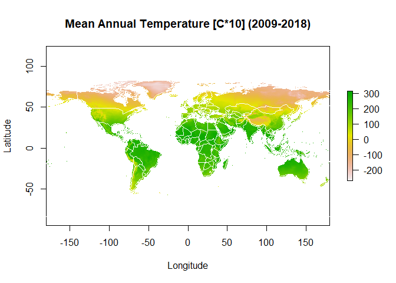
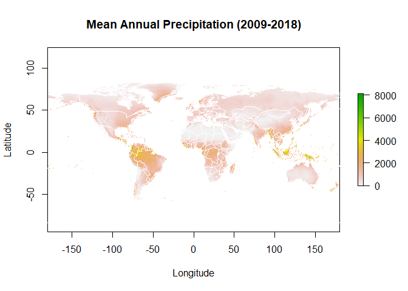
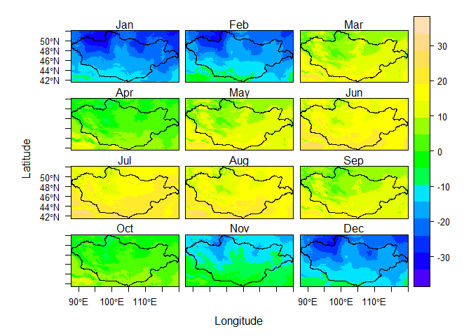
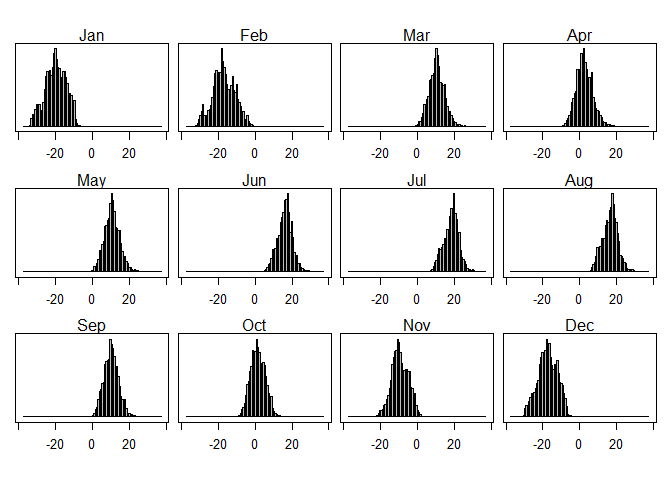
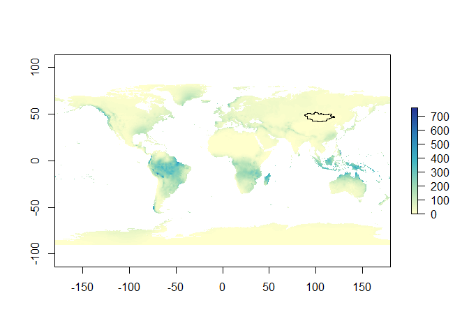
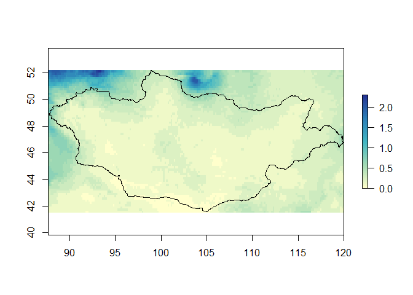
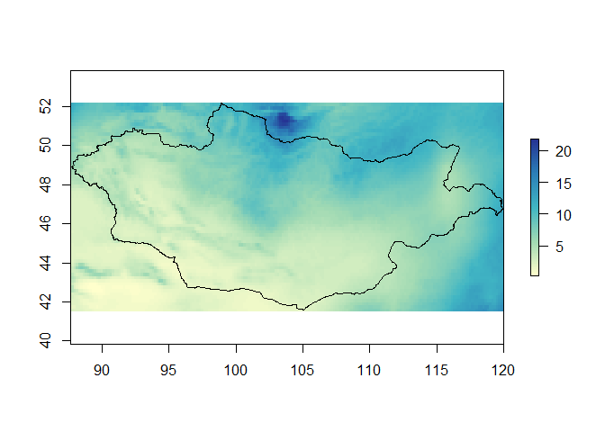
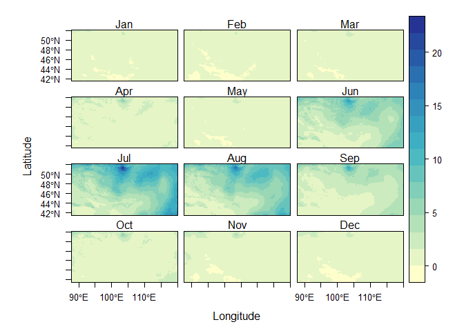
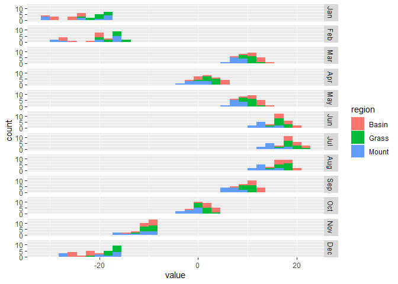
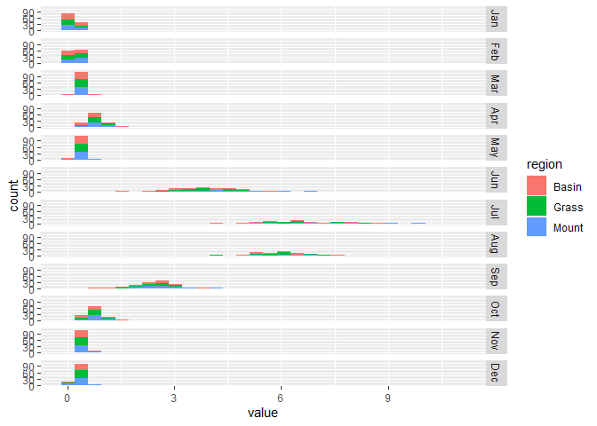

Extracting Climate Statistics from Spatial Data - Tutorial
================

#### Note

This tutorial was created to help students interested in developing
their skills in GIS and R. 

#### Goal Familiarize yourself with R
Studio by mapping and visualizing climate data. You will be working with
WorldClim global climate data (temperature and precipitation) with a
special focus on subsetting data to Mongolia. You can read more about
this dataset at <http://www.worldclim.org/>. 

#### Getting the data
If you are downloading the tutorial and data from Github you should
follow these steps to more easily access data and run through the code
provided. <br /> 1) Create a folder in your “C:/” drive called
“Tutorial”.<br /> 2) Download the *climate\_tutorial.zip* file and
unzip the contents to the *Tutorial* folder.<br /> 3) Make sure that the
filepath to the data is C:/Tutorial/climate\_tutorial or set your own
working directory. 4) Unpack all .bil, .hdr, and .tif files to the
*climate\_tutorial* folder <br /><br /> Files included: <br />
*Ecoregion shapefiles (ecoregion)* <br /> *Monthly precipitation rasters
(prec\_19)* <br /> *Mean monthly temperature rasters (tmean\_10m\_bil)*
<br /> <br />

#### Required libraries

``` r
# If you don't have these libraries, you will need to run install.packages("LIBRARYNAME") to download them. I have included a function in the R file tutorial that should automatically download the libraries for you.

library(raster)
library(sp)
library(rgdal)
library(ggplot2)
library(reshape2)
library(rasterVis)
library(RColorBrewer)
library(maps)
library(rnaturalearth)
library(rnaturalearthdata)
library(sf)
```

<br />

#### Set working directory

setwd(“C:/Tutorial/ClimateTutorial”)

<br />

#### Loading spatial data

Get the GADM administrative boundary shapefile for Mongolia

``` r
b <- getData('GADM', country='MNG', level=0) #Level0=country, MNG is Mongolia
aimag <- getData('GADM', country='MNG', level=1) #Level1=aimag, these are like US states
plot(aimag)
```

<!-- -->

#### While data is already included in the tutorial zip folder, you can download ‘WorldClim’ bio data directly from the {raster} package server.

``` r
r <- getData("worldclim", var="bio", res=10) # Resultion is 10 arc second (~1km)
bio <- r[[c(1,12)]] # Bio 1 (Mean Annual Temperature) and Bio 12 (Annual Precipitation)
names(bio) <- c("Temp","Prec")

world <- ne_countries(scale = "medium", returnclass = "sf")

# Plot temperature
plot(bio$Temp, main = "Mean Annual Temperature [C*10] (2009-2018)", xlab = "Longitude", ylab = "Latitude")
map("world", lwd = 0.5, col = "white", add = TRUE)
```

<!-- -->

``` r
# Give the map an interesting color ramp
preccol = brewer.pal(5, "YlGnBu")
pal <- colorRampPalette(preccol)

# Plot precipitation
plot(bio$Prec, main="Mean Annual Precipitation (2009-2018)", xlab = "Longitude", ylab = "Latitude")
map("world", lwd = 0.5, col = "white", add=TRUE)
```

<!-- -->

Get shapefiles of ecoregions from the “climate\_tutorial/ecoregions”
folder

``` r
grass <- readOGR(dsn = "C:/Users/niko8816/Desktop/Tools/R/climateTutorial/data", layer = "grassland")
```

    ## OGR data source with driver: ESRI Shapefile 
    ## Source: "C:\Users\niko8816\Desktop\Tools\R\climateTutorial\data", layer: "grassland"
    ## with 1 features
    ## It has 17 fields

    ## OGR data source with driver: ESRI Shapefile 
    ## Source: "C:\Users\niko8816\Desktop\Tools\R\climateTutorial\data", layer: "mountain_steppe"
    ## with 1 features
    ## It has 17 fields

    ## OGR data source with driver: ESRI Shapefile 
    ## Source: "C:\Users\niko8816\Desktop\Tools\R\climateTutorial\data", layer: "terminal_basin"
    ## with 1 features
    ## It has 17 fields

<br />

Take a look at Grassland and Terminal Basin ecoregion shapefiles on top
of the Temperature raster

``` r
plot(crop$Temp, legend = FALSE, xaxt = 'n', yaxt = 'n')
plot(grass.trans, add=TRUE)
plot(basin.trans, add=TRUE)
```

<!-- -->

#### Creating Sample Points

Let’s create random sample points within the Mongolia boundary just to
look at what information we can extract with them. Then we we plot the
map of Worldclim temperature data, Monogolia boundary, and the new
sample points.

``` r
points <- spsample(as(b, 'SpatialPolygons'),n=100, type="random")

plot(crop[["Temp"]])
plot(b, add=TRUE)
plot(points, add=TRUE)
```

<!-- -->

Let’s create random sample points within the **Mountain Steppe**
ecoregion just to look at them and plot them over the precipitation
raster.

``` r
mount.points <- spsample(as(mount.trans, 'SpatialPolygons'),n=100, type="random")

plot(crop[["Prec"]])
plot(mount.trans, add=TRUE)
plot(mount.points, add=TRUE)
```

<!-- -->

Now create a data table of values extracted from random points
throughout all of Mongolia

``` r
values <- extract(bio, points) # Extract Temp and Precip values from the points
df <- cbind.data.frame(coordinates(points),values) # Creates table of point coordinates and values
head(df) # Just show the top few values of table.
```

    ##           x        y Temp Prec
    ## 1  99.71339 42.79185   65   51
    ## 2 115.04454 46.76293   14  195
    ## 3 101.84971 46.99231  -16  341
    ## 4 103.16708 44.26859   54  103
    ## 5  95.58416 45.60826    5  121
    ## 6  95.85764 47.59093   -8  142

You can see the point coordinates with the temperature and precipitation
values extracted at each point.

<br />

Now plot all values with regression line to see how Precipitation
decreases as Temperature increases

<!-- -->

    ## integer(0)

#### MONTHLY MEAN TEMPERATURE

Now let’s visualize monthly climate values.

``` r
mJan <- raster("tmean1.bil") #mean temp for January etc.
mFeb <- raster("tmean2.bil")
mMar <- raster("tmean3.bil")
mApr <- raster("tmean4.bil")
mMar <- raster("tmean5.bil")
mJun <- raster("tmean6.bil")
mJul <- raster("tmean7.bil")
mAug <- raster("tmean8.bil")
mSep <- raster("tmean9.bil")
mOct <- raster("tmean10.bil")
mNov <- raster("tmean11.bil")
mDec <- raster("tmean12.bil")
```

Here is the mean temperature for July and January. Notice the shift.

``` r
tempcol <- colorRampPalette(c("purple", "blue", "skyblue", "green", "lightgreen", "yellow", "orange", "red", "darkred"))

plot(mJul, col=tempcol(100))
```

<!-- -->

``` r
plot(mJan, col=tempcol(100))
```

<!-- -->

<br /> Stack the separate tiles into a single image <br />

``` r
mstack <- stack(mJan, mFeb, mMar, mApr, mMar, mJun, mJul, mAug, mSep, mOct, mNov, mDec)
cutStack <- (crop(mstack, b))/10 # crop to Mongolia shapefile
names(cutStack) <- month.abb # Names stacks by month
```

Plot and create histogram of mean temperature ranges by month.

``` r
levelplot(cutStack, col.regions=topo.colors) + layer(sp.polygons(b))
```

<!-- -->

``` r
histogram(cutStack) # Notice how temperature shifts throughout the year
```

<!-- --> <br />

### MONTHLY PRECIPITATON

Open WorldClim monthly precipitation tiles

``` r
pJan <- raster("prec_01.tif")
pFeb <- raster("prec_02.tif")
pMar <- raster("prec_03.tif")
pApr <- raster("prec_04.tif")
pMay <- raster("prec_05.tif")
pJun <- raster("prec_06.tif")
pJul <- raster("prec_07.tif")
pAug <- raster("prec_08.tif")
pSep <- raster("prec_09.tif")
pOct <- raster("prec_10.tif")
pNov <- raster("prec_11.tif")
pDec <- raster("prec_12.tif")

# Give the map an interesting color ramp
preccol = brewer.pal(5, "YlGnBu")
pal <- colorRampPalette(preccol)

# Take a look!
plot(pFeb, col=pal(100))
plot(b, add=TRUE)
```

<!-- -->

``` r
# Stack separate tiles into a single image
pstack <- stack(pJan, pFeb, pMar, pApr, pMar, pJun, pJul, pAug, pSep, pOct, pNov, pDec)
putStack <- (crop(pstack, b))/10 # crop to Mongolia shapefile
names(putStack) <- month.abb

# Again, see the difference in precipitation between January and July
plot(putStack$Jan, col=pal(100))
plot(b, add=TRUE)
```

<!-- -->

``` r
plot(putStack$Jul, col=pal(100))
plot(b, add=TRUE)
```

<!-- -->

``` r
# Plot and create histogram of mean temperature ranges by month
levelplot(putStack, col.regions=pal)
```

<!-- -->

Notice the dry Mongolian winters, and (relatively) wet summers.

``` r
histogram(putStack)
```

<!-- -->

#### TEMPERATURE BY ECOREGION

Next you can extract the temperature data from each ecoregion polygon to
view differences between them

``` r
grassMean <- extract(cutStack, grass.trans)[[1]]
mountMean <- extract(cutStack, mount.trans)[[1]]
basinMean <- extract(cutStack, basin.trans)[[1]]

n <- dim(grassMean)[1] #for sampling convenience
m <- dim(mountMean)[1]
l <- dim(basinMean)[1]

grassMat <- grassMean[sample(n, 10),] #this is the final extracted data
mountMat <- mountMean[sample(m, 10),]
basinMat <- basinMean[sample(l, 10),]

# This code creates the table style using ggplot2
plotter <- data.frame(rbind(grassMat, mountMat, basinMat), region = c(rep("Grass",10), rep("Mount",10), rep("Basin",10)))
forplo <- melt(plotter)
```

    ## Using region as id variables

``` r
g1 <- ggplot(forplo, aes(x = value, fill = region)) + geom_histogram() + facet_grid(variable~.)
```

The plot shows the range of temperature in each ecoregion. You can see
that the Mountain Steppe is the coolest region, while the Terminal Basin
is the hottest with the most diverse range

``` r
plot(g1)
```

    ## `stat_bin()` using `bins = 30`. Pick better value with `binwidth`.

<!-- -->

<br />

#### PRECIPITATION BY ECOREGION

Now let’s look at precipitation differences

<br /> Now you can see that There is mostly NO precipitation in
December-Februrary. Summer precipitation is high but infrequent.

    ## `stat_bin()` using `bins = 30`. Pick better value with `binwidth`.

<!-- -->
